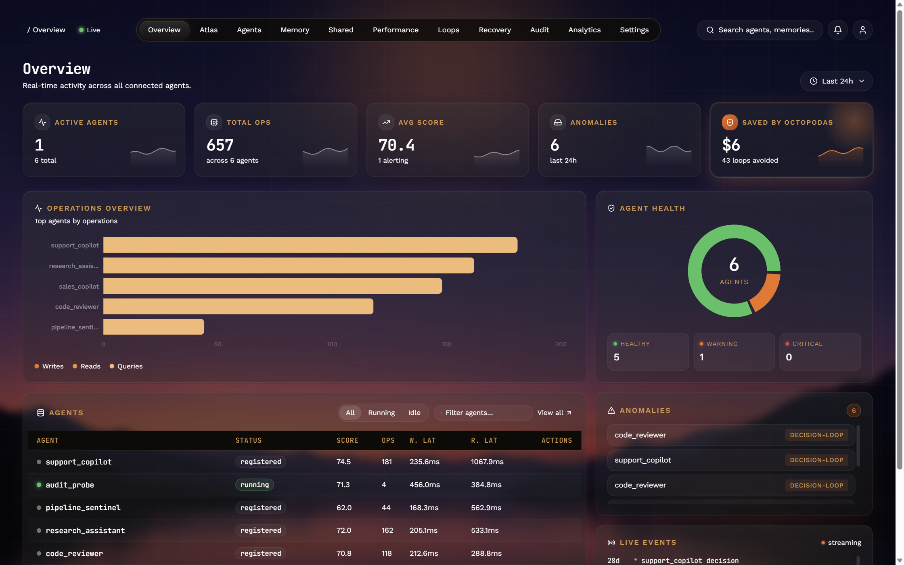
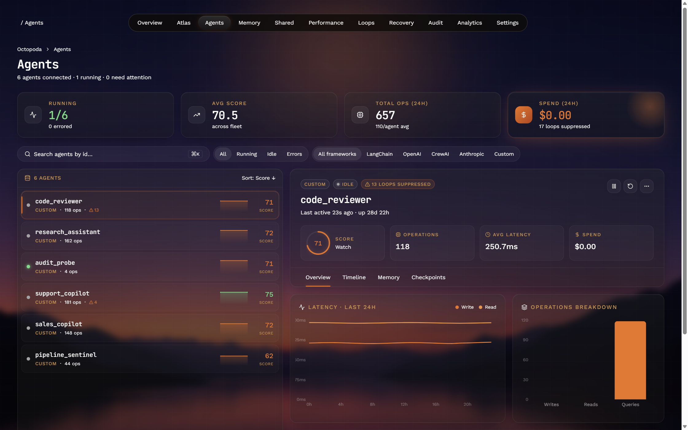
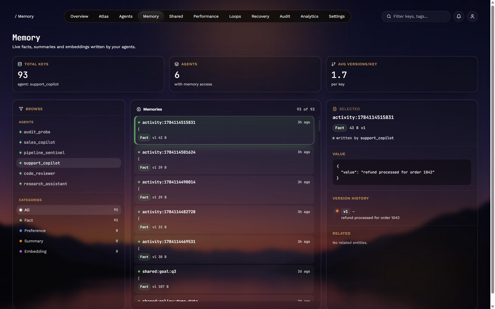
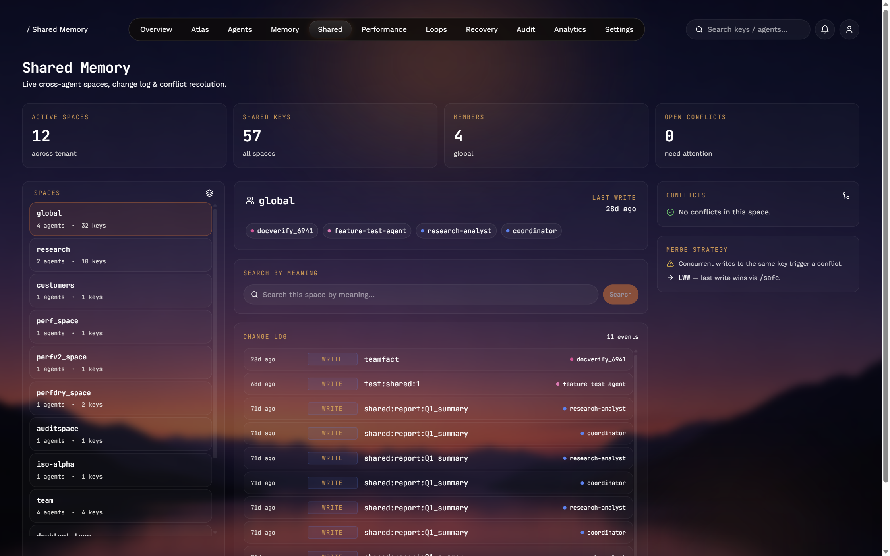
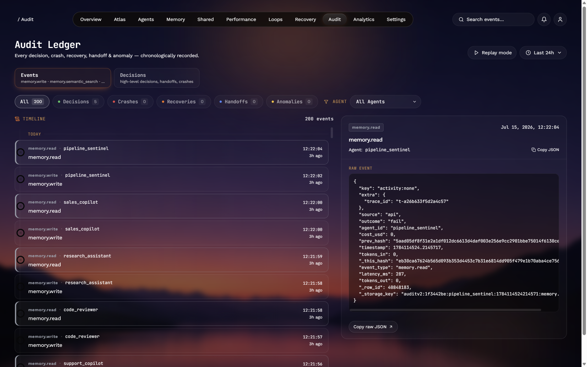

<h1 align="center">🐙 Octopoda</h1>

<p align="center">
  <strong>The open-source memory and observability layer for AI agents.</strong><br />
  Persistent memory, loop detection, audit trails, and a live dashboard — automatic on <code>pip install</code>.
</p>

<p align="center">
  <a href="https://pypi.org/project/octopoda/"></a>
  <a href="https://pypi.org/project/octopoda/"></a>
  <a href="https://github.com/RyjoxTechnologies/Octopoda-OS/actions/workflows/ci.yml"></a>
  <a href="https://github.com/RyjoxTechnologies/Octopoda-OS/actions/workflows/smoke.yml"></a>
  <a href="LICENSE"></a>
  <a href="https://www.python.org/downloads/"></a>
  <a href="https://github.com/RyjoxTechnologies/Octopoda-OS/stargazers"></a>
</p>

<p align="center">
  <a href="https://octopodas.com"><b>Website</b></a> ·
  <a href="https://octopodas.com/docs"><b>Docs</b></a> ·
  <a href="https://octopodas.com/dashboard"><b>Dashboard</b></a> ·
  <a href="#quick-start"><b>Quick start</b></a> ·
  <a href="#mcp-server"><b>MCP server</b></a>
</p>

<p align="center">
  
</p>

<p align="center"><sub><i>Live fleet overview: agent health, operations volume, per-agent scores, the anomaly stream, and the loops caught before they burned tokens. The same dashboard runs locally and in the cloud.</i></sub></p>

---

## Contents

- [What is Octopoda](#what-is-octopoda)
- [The problems it solves](#the-problems-it-solves)
- [Quick start](#quick-start)
- [Local vs cloud](#local-vs-cloud)
- [What you get out of the box](#what-you-get-out-of-the-box)
- [Agents](#agents) · [Memory](#memory) · [Shared memory](#shared-memory) · [Audit trail](#audit-trail)
- [Advanced features](#advanced-features)
- [Framework integrations](#framework-integrations)
- [MCP server](#mcp-server)
- [How it compares](#how-it-compares)
- [Cloud & pricing](#cloud--pricing)
- [Installation](#installation) · [Configuration](#configuration)

---

## What is Octopoda

Octopoda is the layer between your AI agents and a production system that behaves. You write your agent however you like — plain Python, LangChain, CrewAI, AutoGen, the OpenAI Agents SDK, or MCP — and Octopoda sits underneath and handles four things agents consistently get wrong:

- **Memory** that survives every restart, crash, and deploy.
- **Loop detection** that flags a stuck agent in seconds, with the exact calls that caused it.
- **An audit trail** of every decision, write, and recovery — optionally hash-chained and verifiable.
- **A live dashboard** so you can actually see what your agents are doing.

It runs locally with one `pip install` and zero infrastructure. When you outgrow local, the same code syncs to the cloud with a single environment variable — no re-architecture, no migration. The whole thing is MIT-licensed.

If you have ever shipped an agent and watched it forget the user between sessions, loop on a failing API call, or vanish into a black box you couldn't debug, this is the missing layer.

---

## The problems it solves

**Agents forget on every restart.** The moment your process restarts, the agent loses everything it knew about the user, the task, and the conversation. Octopoda gives every agent persistent memory that survives restarts, crashes, deployments, and kills — versioned by default.

**Agents loop, and quietly burn money.** A stuck agent retrying a failing tool call can spend real money before anyone notices. Octopoda's detector catches retry, oscillation, ping-pong, reflection, and recall-write patterns in seconds and surfaces exactly which calls caused them. Detection is automatic on every write; intervention (auto-pause, spend cap) is opt-in through the v2 circuit-breaker config, so the policy stays yours.

**Agents are black boxes.** When an agent does something surprising in production, you usually can't reconstruct why. Octopoda logs every decision, write, and recovery into a replayable timeline you can diff over time. Events written through the audit-v2 endpoint are hash-chained per agent (`prev_hash` → `_this_hash`), so you can verify integrity with a single call.

---

## Quick start

Already have an agent on OpenAI, Anthropic, LangChain, CrewAI, AutoGen, or MCP? Add memory in two lines — no change to your agent's logic:

```bash
pip install octopoda
```

```python
import octopoda
octopoda.init(api_key="sk-octopoda-...")   # the entire integration
```

Octopoda auto-detects your framework, captures what matters from each turn, distills it into memories, and injects relevant recall into future calls — automatically. Or run any agent script unchanged from the terminal:

```bash
export OCTOPODA_API_KEY=sk-octopoda-...
octopoda-run python your_agent.py     # auto-instruments on launch
octopoda-run doctor                   # checks your key + detected frameworks
```

Get a free key at [octopodas.com](https://octopodas.com). Your agents and their memories appear on the live dashboard within about ten seconds of the first turn.

> Running multiple scripts that should share one brain? Set `OCTOPODA_AGENT_ID=my-agent` so they write to the same memory. On slow networks, raise `OCTOPODA_RECALL_TIMEOUT=5` (seconds).

### Or use the SDK directly — local-first, no account

```python
from octopoda import AgentRuntime

agent = AgentRuntime("my_chatbot")
agent.remember("user_name", "Alice")

# kill the process. restart Python. then:
print(agent.recall("user_name").value)
# 'Alice' — still there. Survives every restart, deploy, and crash.
```

That is the whole setup. Your agent now has persistent memory, loop detection, crash recovery, and an audit trail. No config, no Docker, no Redis, no extra services.

### Want the local dashboard?

```bash
pip install octopoda[server]
octopoda
```

Open **http://localhost:7842** — the same dashboard as the cloud version, running against your local data. No account, no API key.

### Want cloud sync + a hosted dashboard?

```bash
octopoda-init
```

It walks you through pasting (or signing up free for) an API key, validates it, and saves it to `~/.octopoda/config.json`. No environment variables to edit. The SDK auto-loads the key on the next import, and the same Python code above writes to the cloud and shows up live at [octopodas.com/dashboard](https://octopodas.com/dashboard).

<details>
<summary>Prefer environment variables?</summary>

```bash
export OCTOPODA_API_KEY=sk-octopoda-...
```

Both methods work. The SDK checks the env var first, then the config file.

</details>

---

## Local vs cloud

Same Python API both ways. Start local; move to cloud when you need sync, team access, or the managed dashboard.

|                    | Local                        | Cloud                           |
|--------------------|------------------------------|---------------------------------|
| Setup              | `pip install octopoda`       | Sign up free at octopodas.com   |
| Storage            | SQLite on your machine       | PostgreSQL + pgvector           |
| Dashboard          | http://localhost:7842        | octopodas.com/dashboard         |
| Account            | Not needed                   | Free, then optional paid tiers  |
| Multi-device sync  | No                           | Yes                             |
| Semantic search    | `octopoda[ai]` extra (~33 MB)| Built-in                        |
| Upgrade path       | Set `OCTOPODA_API_KEY`       | Already there                   |

---

## What you get out of the box

When you create an `AgentRuntime`, all of this runs in the background automatically — no configuration:

| Feature           | What it does                                                               |
|-------------------|----------------------------------------------------------------------------|
| Persistent memory | Survives restarts, crashes, and deploys. Versioned by default.             |
| Loop detection    | Five-signal engine: retry, oscillation, ping-pong, reflection, recall.     |
| Audit trail       | Every write logged; audit-v2 events hashed and chained, replayable.        |
| Crash recovery    | Automatic snapshots and heartbeat-based restore.                           |
| Health scoring    | Continuous per-agent performance and memory-quality monitoring.            |
| Goal tracking     | Set goals and milestones per agent (`agent.set_goal()`).                   |

---

## Agents

Every agent gets a live profile: score, operation count, read/write latency, spend, and loop-suppression stats. Drill into any agent for its latency trend, operation breakdown, timeline, memory, and checkpoints.



---

## Memory

Browse every memory an agent has written, filter by type (fact, preference, summary, embedding), inspect version history, and see exactly how each value changed over time and which agent wrote it.



```python
agent.remember("user_name", "Alice")
agent.recall("user_name").value          # 'Alice'
agent.recall_history("user_name")        # every prior version, newest first
```

Memory is versioned automatically — each write appends a new version, and nothing is silently overwritten.

---

## Shared memory

Multiple agents working on the same problem can share knowledge through named memory spaces. Writes are atomic, reads are immediate, and every change is logged with its author — so you always know which agent contributed what.



```python
research_agent.share("market_size", "$2.1B AI memory market by 2027", space="team-knowledge")
result = coding_assistant.read_shared("market_size", space="team-knowledge")
print(result.value)  # "$2.1B AI memory market by 2027"
```

Spaces track authorship and timestamps for every write. Concurrent writes to the same key surface as a conflict (last-write-wins by default via `/safe`); use `agent.shared_conflicts(space="team-knowledge")` to review them.

---

## Audit trail

Every decision, crash, recovery, and anomaly is logged with full context — including a memory snapshot captured at the moment of the decision. Replay any time window and see exactly what each agent knew, decided, and why.



```python
agent.log_decision(
    decision="Keep single VPS instead of Kubernetes",
    reasoning="Current traffic doesn't justify K8s complexity.",
    context={"current_rps": 14000, "threshold_rps": 1000000},
)
```

Every `log_decision` captures a memory snapshot at that instant, and a built-in similarity check warns you when a decision repeats a recent one. The timeline shows decisions alongside crashes and recoveries, filterable per agent.

For tamper-evident provenance, write through the audit-v2 endpoints (`POST /v1/auditv2/event`, `GET /v1/auditv2/events`). Those events are hashed and chained per agent (`prev_hash` → `_this_hash`); `GET /v1/auditv2/verify-chain` returns `ok=true` plus a per-agent breakdown. The legacy `log_decision()` call writes a simpler row without the chain — route through audit-v2 when you need verifiable integrity.

---

## Advanced features

Everything below is optional. Reach for it when you need it.

<details>
<summary><b>Semantic search</b> — find memories by meaning, not exact keys</summary>

```python
agent.remember("bio", "Alice is a vegetarian living in London")
results = agent.recall_similar("what does the user eat?")
# Returns the right memory with a similarity score
```

In **cloud mode**, embeddings are computed server-side and this works out of the box. In **local mode**, install the AI extra (`pip install octopoda[ai]`) so the local embedding model (~33 MB, CPU) can run. Without it, `recall_similar` returns 0 results locally and logs a warning.

</details>

<details>
<summary><b>Agent messaging</b> — agents talk through shared inboxes</summary>

```python
agent_a.send_message("agent_b", "Found a bug in auth", message_type="alert")
messages = agent_b.read_messages(unread_only=True)
```

</details>

<details>
<summary><b>Goal tracking</b> — goals and milestones per agent</summary>

```python
agent.set_goal("Migrate to PostgreSQL", milestones=["Backup", "Schema", "Migrate", "Validate"])
agent.update_progress(milestone_index=0, note="Backup done")
```

</details>

<details>
<summary><b>Memory management</b> — forget, consolidate, health</summary>

```python
agent.forget("outdated_config")                   # delete a specific memory
agent.forget_stale(max_age_seconds=30*86400)      # clean up memories older than 30 days
agent.consolidate(dry_run=False)                  # merge near-duplicates
agent.memory_health()                             # health report
```

</details>

<details>
<summary><b>Snapshots & recovery</b></summary>

```python
agent.snapshot("before_migration")
# ... something goes wrong ...
agent.restore("before_migration")
```

</details>

<details>
<summary><b>Export / import</b></summary>

```python
bundle = agent.export_memories()
new_agent.import_memories(bundle)
```

</details>

---

## Framework integrations

Drop into the framework you already use. One line, and your agents get persistent memory. All integrations work locally (no API key) or with cloud sync (`OCTOPODA_API_KEY`).

<details>
<summary><b>LangChain</b> — drop-in conversation memory</summary>

```python
from octopoda import LangChainMemory
memory = LangChainMemory("my-chain")
memory.save_context({"input": "I prefer dark mode"}, {"output": "Got it!"})
variables = memory.load_memory_variables({})
```
</details>

<details>
<summary><b>CrewAI</b> — persistent crew findings and task results</summary>

```python
from octopoda import CrewAIMemory
crew = CrewAIMemory("research-crew")
crew.store_finding("researcher", "market_size", {"value": "$4.2B"})
finding = crew.get_finding("market_size")
```
</details>

<details>
<summary><b>AutoGen</b> — multi-agent conversation memory</summary>

```python
from octopoda import AutoGenMemory
memory = AutoGenMemory("dev-team")
memory.store_message("user_proxy", "assistant", "Research quantum computing")
history = memory.get_conversation_history()
```
</details>

<details>
<summary><b>OpenAI Agents SDK</b> — thread and run persistence</summary>

```python
from octopoda import OpenAIAgentsMemory
memory = OpenAIAgentsMemory()
memory.store_thread_state("thread_001", {"messages": [...]})
restored = memory.restore_thread("thread_001")
```
</details>

---

## MCP server

Give Claude, Cursor, or any MCP-compatible client persistent memory with zero code.

```bash
pip install octopoda[mcp]
```

**Claude Code:**

```bash
claude mcp add octopoda -s user -e OCTOPODA_API_KEY=sk-octopoda-YOUR_KEY -- python -m synrix_runtime.api.mcp_server
```

**Claude Desktop** (`claude_desktop_config.json`):

```json
{
  "mcpServers": {
    "octopoda": {
      "command": "python",
      "args": ["-m", "synrix_runtime.api.mcp_server"],
      "env": { "OCTOPODA_API_KEY": "sk-octopoda-YOUR_KEY" }
    }
  }
}
```

28 tools for memory, search, loop detection, goals, messaging, decisions, and snapshots.

<details>
<summary><b>A note on tool names (the double prefix)</b></summary>

When you register the server as `octopoda`, the MCP client prefixes each tool with the server name. So the server-side `octopoda_remember` is exposed to your agent as `octopoda_octopoda_remember`. That is correct client behaviour — just use the exposed name when you write skill files. If you register the server under a different name (`claude mcp add memory ...`), the prefix changes to match. The full set of server-side tool names:

`octopoda_remember` · `octopoda_recall` · `octopoda_search` · `octopoda_recall_similar` · `octopoda_recall_history` · `octopoda_related` · `octopoda_snapshot` · `octopoda_restore` · `octopoda_share` · `octopoda_read_shared` · `octopoda_list_agents` · `octopoda_agent_stats` · `octopoda_process_conversation` · `octopoda_get_context` · `octopoda_log_decision` · `octopoda_forget` · `octopoda_forget_stale` · `octopoda_memory_health` · `octopoda_consolidate` · `octopoda_loop_status` · `octopoda_loop_history` · `octopoda_send_message` · `octopoda_read_messages` · `octopoda_broadcast` · `octopoda_set_goal` · `octopoda_get_goal` · `octopoda_update_progress` · `octopoda_search_filtered`

</details>

---

## How it compares

|                        | Octopoda                                       | Mem0             | Zep              | LangChain Memory |
|------------------------|------------------------------------------------|------------------|------------------|------------------|
| License                | MIT                                            | Apache 2.0       | Partial (CE)     | MIT              |
| Local-first            | Yes (SQLite)                                   | Cloud-first      | Cloud-first      | In process       |
| Loop detection         | Five-signal engine                             | —                | —                | —                |
| Agent messaging        | Built in                                       | —                | —                | —                |
| Audit trail            | Hash-chained (audit-v2)                        | —                | —                | —                |
| Crash recovery         | Snapshots + restore                            | —                | —                | —                |
| Shared memory          | Built in                                       | —                | —                | —                |
| MCP server             | 28 tools                                       | —                | —                | —                |
| Semantic search        | Local or cloud embeddings                      | Cloud embeddings | Cloud embeddings | Needs vector DB  |
| Framework integrations | LangChain, CrewAI, AutoGen, OpenAI Agents SDK  | LangChain        | LangChain        | Own only         |

---

## Cloud & pricing

Sign up free at [octopodas.com](https://octopodas.com) for the hosted dashboard, managed storage, and cloud API.

```python
from octopoda import Octopoda

client = Octopoda()              # uses OCTOPODA_API_KEY
agent = client.agent("my_agent")
agent.write("preference", "dark mode")
results = agent.search("user preferences")
```

|                | Free      | Pro ($19/mo)  | Business ($49/mo) | Scale ($99/mo)   |
|----------------|-----------|---------------|-------------------|------------------|
| Agents         | 5         | 25            | 75                | Unlimited        |
| Memories       | 5,000     | 250,000       | 1,000,000         | 5,000,000        |
| AI extractions | 100       | 10,000        | 50,000            | Unlimited        |
| Rate limit     | 60 rpm    | 300 rpm       | 1,000 rpm         | 5,000 rpm        |
| Loop detection | Basic     | Full v2       | Full v2           | Full v2          |
| Shared spaces  | 1         | 5             | Unlimited         | Unlimited        |
| Dashboard      | Yes       | Yes           | Yes               | Yes              |
| Support        | Community | Email (48h)   | Priority          | Dedicated        |

---

## Installation

```bash
pip install octopoda              # Core — everything to get started (Python 3.9+)
pip install octopoda[ai]          # + local embeddings for semantic search
pip install octopoda[server]      # + local dashboard server (Flask)
pip install octopoda[nlp]         # + spaCy for knowledge-graph extraction
pip install octopoda[mcp]         # + MCP server for Claude/Cursor (Python 3.10+)
pip install octopoda[all]         # everything (Python 3.10+)
```

> **Python versions.** The core package supports Python 3.9+. The `[mcp]` extra needs 3.10+ (the upstream `mcp` library does). On 3.9 and want everything except MCP? Use `pip install octopoda[ai,server,nlp]`.

> **Local mode.** Running without an API key gives you a fully working local install backed by SQLite at `~/.synrix/data/synrix.db`. `OCTOPODA_API_KEY` accepts the sentinels `local`, `offline`, `dev`, `none`, or `YOUR_KEY_HERE` to force local mode explicitly. Real cloud keys start with `sk-octopoda-`; anything else is treated as a local sentinel.

> **Updating an MCP registration.** If you change the `claude mcp add octopoda ...` env vars (e.g. swapping local for cloud), restart the Claude Code window. A `/mcp` reconnect alone won't pick up new env, because the child process inherits Claude Code's cached env at startup.

## Configuration

| Variable                              | Default                  | Description                                              |
|---------------------------------------|--------------------------|----------------------------------------------------------|
| `OCTOPODA_API_KEY`                    | —                        | Cloud API key (free at octopodas.com)                    |
| `OCTOPODA_LICENSE_KEY`                | —                        | License key for higher tiers (optional)                  |
| `OCTOPODA_LLM_PROVIDER`               | `none`                   | `openai`, `anthropic`, or `ollama`                       |
| `OCTOPODA_OPENAI_API_KEY`             | —                        | Your OpenAI key for local fact extraction                |
| `OCTOPODA_EMBEDDING_MODEL`            | `BAAI/bge-small-en-v1.5` | Local embedding model (~33 MB, CPU)                      |
| `SYNRIX_DATA_DIR`                     | `~/.synrix/data`         | Local data directory (SQLite + embeddings)               |
| `OCTOPODA_LOCAL_MODE`                 | unset                    | Set to `1` to force local mode regardless of the API key |
| `SYNRIX_HEARTBEAT_INTERVAL_SEC`       | `3`                      | Daemon heartbeat interval (raise for low-resource boxes) |
| `SYNRIX_MAX_VERSIONS_PER_RUNTIME_KEY` | `10`                     | Cap on `runtime:*` / `metrics:*` key versions            |

---

## Verification harnesses

The repo ships scripts under `scripts/integration/` that exercise the product end to end against both a fresh PyPI install and live `api.octopodas.com`. Clone and rerun them:

- `audit_verify_3_1_13.py` — live HTTP probes against production.
- `mcp_stdio_harness.py` — drives `octopoda-mcp` over JSON-RPC the way Claude Code does.
- `user_simulation.py` — fresh venv, `pip install octopoda` from PyPI, exercises every SDK path.
- `local_dashboard_smoke.py` — proves the bundled dashboard serves byte-identical assets to the cloud one.

## Contributing

See [CONTRIBUTING.md](CONTRIBUTING.md) for setup and guidelines, and [ROADMAP.md](ROADMAP.md) for what's planned.

## Security

See [SECURITY.md](SECURITY.md) for reporting vulnerabilities.

## License

MIT — use it however you want. See [LICENSE](LICENSE).

---

<p align="center">
  Built by <a href="https://octopodas.com">RYJOX Technologies</a> ·
  <a href="https://pypi.org/project/octopoda/">PyPI</a> ·
  <a href="https://api.octopodas.com/docs">Cloud API</a> ·
  <a href="https://octopodas.com/dashboard">Dashboard</a>
</p>
